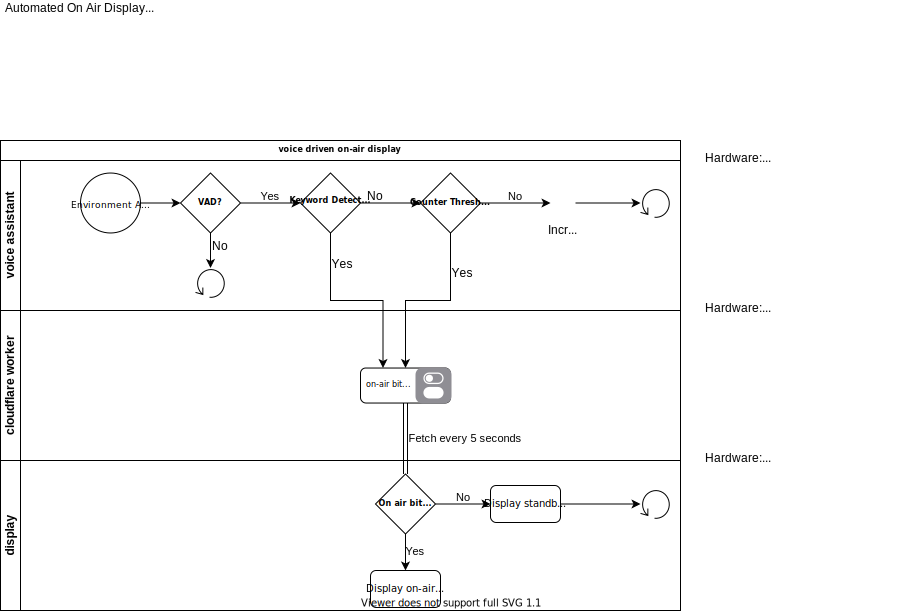

# About
The On Air project is a display that alerts others when you are collaborating
with others.

The "On Air" repo contains the code and documentation for a project that
includes a VAD (voice activity detection) and Tensorflow Lite model to
automatically update an API when the trigger word "On" is followed by "Air".

Additionally the VAD will update the API if a given amount of time goes by
with continous voice activity that does not contain the trigger keyword.

## Logic Flow

## Getting Started

Each directory is a submodule that contains the code specific to an
environment/hardware as seen in the lanes of the flow above.
